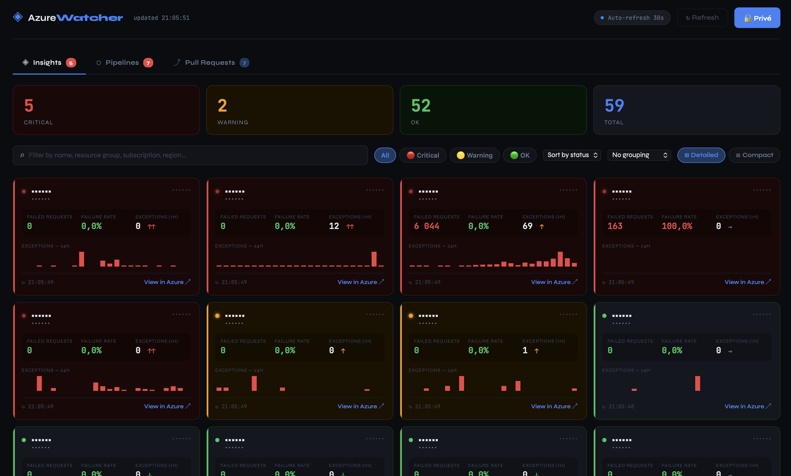

# AzureWatcher

AzureWatcher is an open-source monitoring dashboard that gives you a centralized, real-time view of your Azure ecosystem.

It automatically discovers all your Application Insights resources across all your Azure subscriptions, tracks key health metrics, and surfaces your Azure DevOps activity — all in a single interface that refreshes every 30 seconds.

## Key features

- **Multi-subscription discovery** — automatically finds all App Insights resources via Azure Resource Graph
- **Real-time health monitoring** — failed requests, error rates, and 24h exception history with visual status indicators (critical / warning / healthy)
- **Azure DevOps integration** — pipeline statuses, run timelines, and open pull requests with review status
- **Browser-based authentication** — interactive sign-in via Azure Identity with token caching; no secrets to manage locally
- **Auto-refresh** — dashboard polls every 30 seconds to stay up to date

**Built with:** .NET 10, Blazor Server, Azure SDK, Azure Resource Graph, Azure Monitor, Azure DevOps REST API

## Prerequisites

- .NET 10 SDK
- An Azure account with read access to subscriptions, AppInsights resources, and Azure DevOps

## Configuration

Local settings (organization URL, secrets) go in `appsettings.Local.json` at the project root.
This file is git-ignored.

Create the file `AzureInsightsDashboard/appsettings.Local.json`:

```json
{
  "AzureDevOps": {
    "OrganizationUrl": "https://dev.azure.com/<your-organization>"
  }
}
```

Alternatively, pass the value via the command line at startup:

```bash
dotnet run --AzureDevOps:OrganizationUrl="https://dev.azure.com/<your-organization>"
```

Or via an environment variable (`:` is replaced by `__`):

```bash
# Linux / macOS
export AzureDevOps__OrganizationUrl="https://dev.azure.com/<your-organization>"
dotnet run

# Windows PowerShell
$env:AzureDevOps__OrganizationUrl="https://dev.azure.com/<your-organization>"
dotnet run
```

## Running

```bash
cd AzureInsightsDashboard
dotnet run
```

The app starts at `https://localhost:5221`.
On the first click on "Sign in to Azure", your browser will open for Microsoft authentication.
The token is cached for the lifetime of the process.

## Required Azure permissions

| Scope               | Permission                 |
|---------------------|----------------------------|
| Azure Subscriptions | `Reader`                   |
| Azure Monitor       | `Monitoring Reader`        |
| Azure DevOps        | Organization member access |

## Architecture

```
Services/
  CredentialService.cs       → Singleton: holds the InteractiveBrowserCredential (MSAL)
  AzureDiscoveryService.cs   → Azure Resource Graph, multi-subscription discovery
  MetricsService.cs          → Azure Monitor Metrics API
  AzureDevOpsService.cs      → Azure DevOps REST API (pipelines, pull requests)
  DashboardService.cs        → Orchestration, 30s polling, state management

Models/
  AppInsightsResource.cs     → AppInsights models + status computation + trends
  Pipeline.cs                → Pipeline models + run history
  PullRequest.cs             → Pull request models + review status

Components/Pages/
  Dashboard.razor            → Main UI (3 tabs: Insights / Pipelines / Pull Requests)
```

## AppInsights status computation

| Status      | Condition                                                          |
|-------------|--------------------------------------------------------------------|
| 🔴 Critical | > 50 failed requests/hour OR exception trend StrongIncrease        |
| 🟡 Warning  | > 10 failed requests/hour OR exception trend Increase              |
| 🟢 OK       | Otherwise                                                          |

## Customization

- Status thresholds: `Models/AppInsightsResource.cs` → `ComputeStatus()`
- Polling interval: `Services/DashboardService.cs` → `PollingInterval`
